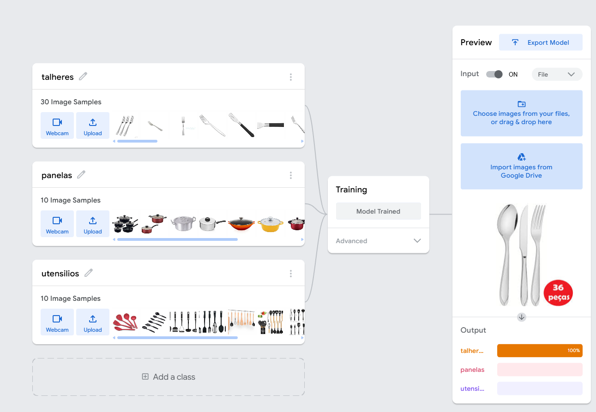

# Relatório de entrega da atividade

## I. Descrição dos objetivos e da metodologia utilizada.

- Desenvolver um modelo de IA capaz de detectar e classificar diferentes utensílios de cozinha a partir de fotografias.
- Familiarizar-se com os conceitos básicos de aprendizado de máquina e visão computacional.
- Aprender a utilizar o Teachable Machine para criar modelos de IA interativos.
- Avaliar a eficiência do modelo desenvolvido na detecção e classificação de utensílios de cozinha.

Repositório com o modelo e imagens: [https://github.com/RM567904/1TIAOR/tree/main/fase1/cap2](https://github.com/RM567904/1TIAOR/tree/main/fase1/cap2)

<!-- Quebra de página -->

## II. Principais etapas do projeto

Prints das principais etapas do projeto, incluindo da taxa de acurácia final.

<!-- Quebra de página -->

| Teste | Resultado esperado | Acurácia |
|-------|--------------------|----------|
|  Conjunto de Panelas | Panela |  98% |
|  Caldeirão | Panela | 100% |
|  Frigideira | Panela | 74% |
|  Panela Elétrica | Panela | 95% |
|  Conjunto de talheres | Talher | 100% |
|  Garfo e Colher (Epoch = 50) | Talher | 0% |
|  Garfo e Colher (Epoch = 70) | Talher | 63% |
|  Utensilios de Madeira | Utensilios | 100% |
|  Utensilios de Plastico | Utensilios | 99% |

<!-- Quebra de página -->

## III. Explicação de como cada etapa foi realizada.

1. Criei 3 pastas para separar cada tipo de imagem: talheres, panelas e utensilios
2. Criei 2 pastas para separar as imagens de treino das de teste
3. Busquei aleatoriamente no google imagens de colheres, facas, garfos, panelas e utensilios e baixei as imagens nas respectivas pastas
4. Criei 4 categorias no Teachable: talheres, panelas e utensilios e carreguei as respectivas imagens para cada categoria
5. Executei o treino do modelo
6. Testes com as imagens de teste que salvei na pasta imagens/teste

## IV. Justificativa técnica dos resultados obtidos.

Com um conjunto de aprox. apenas 10 imagens de cada tipo foi suficiente para ter uma boa acurácia do modelo na maioria dos casos sem alteração nos parametros padrão.

## V. Análise crítica do desempenho do modelo e sugestões de melhorias.

No caso das panelas, apesar de não ter nenhum exemplo de "caldeirão" nas imagens de treinamento, detectou com 100% de precisão, o que surpreendeu. Já em relação a "frigideira" não se saiu tão bem. Também falhou no caso do "Garfos de Madeira", ao identificar como utensilio, imagino que seja ao fato das imagens de treino de talheres com o mesmo vies de material, no caso inox. 

Outro caso interessante foi constatar o aumento de acurácia de 0% para 63% ao alterar o paramentro Epoch de 50 para 70.

No caso dos talheres, o treino foi realizado predominantemente como talheres de inox, o que pode enviezar o modelo e dificultar a detecção de outros tipos de material, como sugestão de melhoria, o ideal seria aumentar a amostra das imagens de treino com outros tipos de material como madeira, plástico, ouro, bronze, etc. 